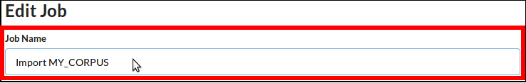

# Create Corpus from Text Files
## Create Import-Folder with Text Files
1. Use the file manager, e.g. Windows File Explorer on Windows or Finder on Mac OS, and navigate to the TopicExplorer-docker project, which is a folder named `TopicExplorer-docker`.
2. Navigate to the subfolder `TopicExplorer-docker` ▶ `volumes` ▶ `input-corpora` ▶ `text`.
3. Within the subfolder `text`, create a new folder with the name of the new corpus, e.g.  `MY_CORPUS`.  
The corpus name
    - has to start with a upper case letter and
    - must not contain any white space characters,
    - after the first character may come up to 16 characters that may be a combination of upper case letters, numbers and underscores.
    - Make sure that the new corpus name has not been used already for any other corpus in any language in your TopicExplorer instance. If in doubt check the corpora overviews on the creator pages of all languages.
4. Copy all text files into the new sub folder, e.g.  `MY_CORPUS`. Make sure that all text files use UTF-8 encoding. Note that word files are not text files.

#### Options
- The folder with the new corpus may contain nested subfolders. In this case, nested folder structure will be converted into flat files later in the import workflow.

#### Result of this step
A new subfolder with the name of new corpus that contains all document as text file, e.g. `TopicExplorer-docker` ▶ `volumes` ▶ `input-corpora` ▶ `text` ▶ `MY_CORPUS` . The corpus name will to be used in the next steps.

## Prepare to specify and run Import with Jobson
The next step will take you to the Jobson user interface that allows you to select the job type, to input the necessary parameters for the job and finally submit and start the job.  
In detail the steps will be:
1. Select in the field *Job Spec* the Option *Import folder with text files*.

2. Then fill out the form below

    1. Choose a meaningful job name.  
    
    2. Specify the corpus name as the input folder, e.g. continuing the example `MY_CORPUS`.  
    
    3. Specify the handling of subfolders, e.g. with or without subfolders of the folder MY_CORPUS.  
    
    4. Select the appropriate combination of TopicExplorer Database, NLP-software and language.  
    
3. Click the Submit button, which submits and also starts the job.

#### Result of the next step
After submitting the job, the job will be started. Jobson will show then job details and output. Furthermore, the overview page of Jobson will show the current state of all jobs (running, fatal-error, finished) including the one just submitted.

## Specify and run Import with Jobson
The Jobson user interface allows you to select the job type, to input the necessary parameters for the job and finally submit and start the job.

1. Select in the field *Job Spec* the Option *Import folder with text files*.  

2. Then fill out the form below

    1. Choose a meaningful job name.  
    
    2. Specify the corpus name as the input folder, e.g. continuing the example `MY_CORPUS`.  
    
    3. Specify the handling of sub folders, e.g. with or without subfolders of the folder MY_CORPUS.  
    
    4. Select the appropriate combination of TopicExplorer Database, NLP-software and language.  
    
3. Click the Submit button, which submits and also starts the job.

#### Result of this step
After submitting the job, the job is started. Jobson shows then job details and output, e.g.  


Furthermore, the overview page of Jobson shows the current state of all jobs (running, fatal-error, finished) including the one just submitted.


## Monitor Import Job until finished

1. You can monitor the submitted Job at the overview page of Jobson. Alternatively, you can see the job details and output at the job specific page that shows details and output of the submitted job.

2. After the import job is successfully finished, the new corpus is complete and available in the Creator of the respective language. The example screen shot shows that `MY_CORPUS` is available in the creator for English using the TreeTagger NLP-software. You might need to click *Update overview* to see the corpus.


#### Result of this step
New corpus, e.g. `MY_CORPUS`, is complete and available at the creator page of the respective language.

# Create Corpus from PDF Files
## Overview
This workflow shows you
1. How to convert a folder with PDF files into a folder or Zip-archive with text files.
2. How to continue with the Workflow "Create Corpus from Text Files" to import the text files as a corpus into TopicExplorer.

## Create Folder with PDF Files
1. Use the file manager, e.g. Windows File Explorer on Windows or Finder on Mac OS, and navigate to the TopicExplorer-docker project, which is a folder named `TopicExplorer-docker`.
2. Navigate to the subfolder `TopicExplorer-docker` ▶ `volumes` ▶ `input-corpora` ▶ `text`.
3. Within the subfolder `PDF`, create a new folder with the name of the new corpus, e.g.  `MY_CORPUS`.  
The corpus name
    - has to start with a upper case letter and
    - must not contain any white space characters,
    - after the first character may come up to 16 characters that may be a combination of upper case letters, numbers and underscores.
    - Make sure that the new corpus name has not been used already for any other corpus in any language in your TopicExplorer instance. If in doubt check the corpora overviews on the creator pages of all languages.
4. Copy all PDF files into the new sub folder, e.g.  `MY_CORPUS`. Note that only the selectable text in the PDF files will be converted. In case the PDF files contain images with text that may come from scanning printed documents, you have to use OCR software like Tesseract (https://github.com/tesseract-ocr/tesseract) or Abbyy FineReader (https://www.abbyy.com) first.

#### Options
- The folder with the new corpus may contain nested subfolders. In this case, nested folder structure will be converted into flat files later in the import workflow.

#### Result of this step
A new subfolder with the name of new corpus that contains all document as PDF file, e.g. `TopicExplorer-docker` ▶ `volumes` ▶ `input-corpora` ▶ `pdf` ▶ `MY_CORPUS` . The corpus name will to be used in the next steps.

## Prepare to specify and run Conversion of PDF files with Jobson
The next step will take you to the Jobson user interface that allows you to select the job type, to input the necessary parameters for the job and finally submit and start the job.  
In detail the steps will be:
1. Select in the field *Job Spec* the Option *Convert folder with pdf files to text files*.

2. Then fill out the form below

    1. Choose a meaningful job name.  
    
    2. Specify the corpus name as the input folder, e.g. continuing the example `MY_CORPUS`.  
    
    3. Specify the handling of subfolders, e.g. with or without subfolders of the folder MY_CORPUS.  
    
    4. Select the destination of the output folder. The following options are available:
      - Output folder as input folder for corpus import. The output folder name must be a valid corpus identifier. The output folder with the text files is saved as subfolder of  `TopicExplorer-docker` ▶ `volumes` ▶ `input-corpora` ▶ `text`. After the pdf-conversion-job is finished, you can directly continue with the job to import the folder with text files as new corpus.
      - Output folder in Download Zip. The text files are saved in a temporary folder that you can download as Zip file archive. This allows you to edit the text files manually to remove noise from the converted text files. Later you can copy the folder with the edited text files into  `TopicExplorer-docker` ▶ `volumes` ▶ `input-corpora` ▶ `text` and import the folder with text files.
3. Click the Submit button, which submits and also starts the job.

#### Result of the next step
After submitting the job, the job will be started. Jobson will show then job details and output. Furthermore, the overview page of Jobson will show the current state of all jobs (running, fatal-error, finished) including the one just submitted.

## Specify and run Conversion of PDF files with Jobson
The Jobson user interface allows you to select the job type, to input the necessary parameters for the job and finally submit and start the job.  
In detail the steps will be:
1. Select in the field *Job Spec* the Option *Convert folder with pdf files to text files*.

2. Then fill out the form below

    1. Choose a meaningful job name.  
    
    2. Specify the corpus name as the input folder, e.g. continuing the example `MY_CORPUS`.  
    
    3. Specify the handling of subfolders, e.g. with or without subfolders of the folder MY_CORPUS.  
    
    4. Select the destination of the output folder. The following options are available:
      - Output folder as input folder for corpus import. The output folder name must be a valid corpus identifier. The output folder with the text files is saved as subfolder of  `TopicExplorer-docker` ▶ `volumes` ▶ `input-corpora` ▶ `text`. After the pdf-conversion-job is finished, you can directly continue with the job to import the folder with text files as new corpus.
      - Output folder in Download Zip. The text files are saved in a temporary folder that you can download as Zip file archive. This allows you to edit the text files manually to remove noise from the converted text files. Later you can copy the folder with the edited text files into  `TopicExplorer-docker` ▶ `volumes` ▶ `input-corpora` ▶ `text` and import the folder with text files.
3. Click the Submit button, which submits and also starts the job.

#### Result of the next step
After submitting the job, the job  is started. Jobson shows then job details and output. Furthermore, the overview page of Jobson shows the current state of all jobs (running, fatal-error, finished) including the one just submitted.


## Monitor Conversion Job until finished

1. You can monitor the submitted Job at the overview page of Jobson. Alternatively, you can see the job details and output at the job specific page that shows details and output of the submitted job.

2. After the conversion job is successfully finished either one of the following two states is present
  - a new subfolder with text files is available in `TopicExplorer-docker` ▶ `volumes` ▶ `input-corpora` ▶ `text` and ready for being imported straight away or
  - a Zip file archive with the text files is available that can be downloaded and unzipped. Then the text files can be manually edited and the folder with the edited text files can be imported.

#### Result of this step
A folder with text files or a Zip file archive that contains the text files. In both cases, use or prepare a folder with text files for import and continue with the workflow *Create Corpus from Text Files*.

# Create Corpus from CSV Speadsheets

## Prepare Corpus
First, choose the right combination of language and NLP software in the navigation bar on the left side.

This workflow assumes that the text documents of the corpus with their
meta data are available as two CSV files that have the following tabular structure:
-  Meta Data CSV-File
```
|| DOCUMENT_ID | TITLE        | URL          | DOCUMENT_DATE        ||
|| INTEGER     | VARCHAR(255) | VARCHAR(255) | 'YYYY-MM-DD hh:mm:ss'||
```
-  Text-Data CSV-File
```
|| DOCUMENT_ID | TEXT ||
|| INTEGER     | TEXT ||
```
Notes
    - The integers in the columns `DOCUMENT_ID` in both files link the meta data to the text.
    - When `TEXT` column in the Text-Data CSV-File contains newlines, the CSV file has to follow the multiline standard for CSV files.

## Input Corpus Name

Input Corpus Name

The corpus name
- has to start with a upper case letter and
- must not contain any white space characters,
- after the first character may come up to 16 characters that may be a combination of upper case letters, numbers and underscores.
- Make sure that the new corpus name has not been used already for any other corpus in any language in your TopicExplorer instance. If in doubt check the corpora overviews on the creator pages of all languages.

## Prepare to Create Database Tables
In the next step, the database tables for meta and text data will be created. The workflow will take you to the Adminer tool that will show a text input field with two prepared create table statements.

Just click the **Execute** Button below the text input. Do not change the SQL-Statements.


#### Result of the next step
Database tables for text and meta data will be created.

## Create Database Tables
Database tables for meta and text data are created in this step. The Adminer tool shows a text input field with two prepared create table statements.

Just click the **Execute** Button below the text input. Do not change the SQL-Statements.


#### Result of this step
Database tables for text and meta data are created.


## Prepare to Import Meta Data
The next step will take you to the Adminer tool and show the select page for the meta-data table that is still empty at the moment.


1. Click **Import**
2. Select the CSV file with the meta data  

3. Choose the column separator. If in doubt, open the CSV file with Calc from Libre Office and try different options in the import wizard.

4. Click Import.  


#### Result of the next step
Database table with meta-data.

## Import Meta Data
This step takes you to the Adminer tool and show the select page for the meta-data table that is still empty at the moment.  


1. Click **Import**
2. Select the CSV file with the meta data  

3. Choose the column separator. If in doubt, open the CSV file with Calc from Libre Office and try different options in the import wizard.

4. Click Import.  


#### Result of the this step
Database table with meta-data.

## Prepare to Import Text Data
The next step will take you to the Adminer tool and show the select page for the text-data table that is still empty at the moment.


1. Click **Import**
2. Select the CSV file with the text data  

3. Choose the column separator. If in doubt, open the CSV file with Calc from Libre Office and try different options in the import wizard.

4. Click Import.  


#### Result of the next step
Database table with text-data.

## Import Text Data
This step takes you to the Adminer tool and show the select page for the text-data table that is still empty at the moment.  


1. Click **Import**
2. Select the CSV file with the text data  

3. Choose the column separator. If in doubt, open the CSV file with Calc from Libre Office and try different options in the import wizard.

4. Click Import.  


#### Result of the this step
Database table with text-data.


## Prepare to register the new Corpus
In the next step, the new corpus will be registered. The workflow will take you to the Adminer tool that will show a text input field with two prepared insert statements.

Just click the **Execute** Button below the text input. Do not change the SQL-Statements.


#### Result of the next step
The new corpus will be registered.


## Register the new Corpus
The new corpus will be registered. The the Adminer tool shows a text input field with two prepared insert statements.

Just click the **Execute** Button below the text input. Do not change the SQL-Statements.


#### Result of the next step
The new corpus is registered.
